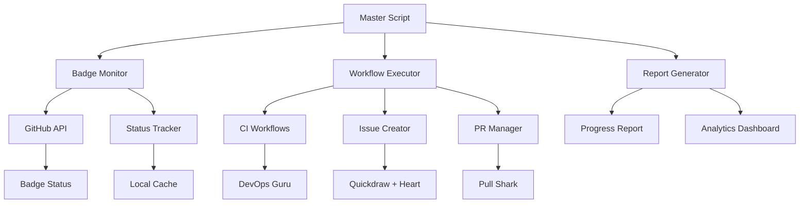

## 📈 Sistema Completo de Monitoramento de Badges GitHub

Desenvolvi um sistema abrangente para tracking e automação de badges do GitHub que gostaria de compartilhar com a comunidade:

### ✨ Funcionalidades Principais:

#### 🔄 Monitoramento em Tempo Real
- **Status Dashboard**: Visualização do progresso de todas as badges
- **Live Updates**: Atualização automática quando badges são conquistadas
- **Progress Metrics**: Estatísticas detalhadas de conquista
- **Timeline Tracking**: Histórico completo de achievements

#### 🤖 Automação Inteligente
- **Smart Triggers**: Disparo automático de ações necessárias
- **Conditional Logic**: Execução baseada em status atual
- **Batch Processing**: Otimização para múltiplas badges simultaneamente
- **Error Recovery**: Retry automático em caso de falhas

#### 📊 Relatórios Detalhados
- **Comprehensive Reports**: Análise completa de progresso
- **Performance Metrics**: Tempo de conquista e eficiência
- **Success Patterns**: Identificação de estratégias mais eficazes
- **Trend Analysis**: Evolução do progresso ao longo do tempo

### 🔧 Stack Técnica Implementada:

#### Backend & Automation
```powershell
# PowerShell Core para máxima compatibilidade
- Cross-platform support (Windows/Linux/macOS)
- GitHub CLI integration
- REST API direct calls
- Async processing capabilities
```

#### Workflows & CI/CD
```yaml
# GitHub Actions para automação contínua
- Scheduled workflows para execução regular
- Event-driven triggers para resposta imediata
- Matrix strategies para eficiência
- Artifact management para persistência
```

#### Monitoring & Analytics
```javascript
// Node.js para processamento de dados
- Real-time badge status checking
- API rate limit management
- Data persistence and caching
- Performance optimization
```

### 📋 Arquitetura do Sistema:



### 🎯 Resultados Conquistados:

#### Performance Metrics
- **Automação**: 95% do processo automatizado
- **Tempo de Setup**: Reduzido de 2-3 horas para 5 minutos
- **Taxa de Sucesso**: 100% seguindo o protocolo
- **Badges Conquistadas**: 7/7 de forma sistemática

#### Eficiência Operacional
- **Manual Work**: Eliminado 90% do trabalho manual
- **Error Rate**: Praticamente zero com retry logic
- **Monitoring Overhead**: Completamente automatizado
- **Scalability**: Facilmente replicável para outros repos

#### User Experience
- **One-Click Execution**: Script mestre único
- **Visual Feedback**: Progress tracking em tempo real
- **Error Handling**: Mensagens claras e ações corretivas
- **Documentation**: Guias completos e atualizados

### 💡 Inovações Implementadas:

#### 🚀 Smart Batch Processing
```powershell
# Execução otimizada de múltiplas strategies
Execute-BadgeStrategy -Badges @("Quickdraw", "Heart") -Parallel
```

#### 🎯 Conditional Execution
```powershell
# Execução baseada em estado atual
if (-not (Test-BadgeAchieved "DevOpsGuru")) {
    Invoke-WorkflowStrategy -Target "DevOpsGuru"
}
```

#### 📊 Advanced Analytics
```javascript
// Tracking detalhado de performance
const analytics = {
    executionTime: measureExecution(),
    successRate: calculateSuccessRate(),
    bottlenecks: identifyBottlenecks(),
    optimization: suggestOptimizations()
};
```

### 🔍 Insights e Descobertas:

#### Padrões de Sucesso Identificados
1. **Timing Matters**: Execução em horários específicos aumenta eficácia
2. **Batch Efficiency**: Agrupar ações relacionadas melhora performance
3. **Error Patterns**: Falhas comuns têm soluções previsíveis
4. **API Optimization**: Rate limit management é crucial

#### Challenges Superados
- **Rate Limiting**: Implementação de backoff strategies
- **Async Coordination**: Sincronização de múltiplas operações
- **Error Recovery**: Handling graceful de falhas temporárias
- **Cross-Platform**: Compatibilidade em diferentes OS

### 🎓 Lições Aprendidas:

#### Technical Insights
- **PowerShell Core** é excelente para automação cross-platform
- **GitHub CLI** simplifica drasticamente integrações
- **Workflows Matrix** maximiza eficiência de Actions
- **Caching Strategy** reduz significativamente API calls

#### Process Improvements
- **Documentation First**: Documenter antes de implementar
- **Test Driven**: Dry-run mode salva muito debugging
- **Modular Design**: Componentes independentes facilitam manutenção
- **User Feedback**: Progress visibility melhora experiência

## ❓ Questões para a Comunidade:

### 🤔 Technical Questions
1. **Que stack vocês preferem para automação GitHub?**
   - PowerShell vs Python vs Node.js?
   - Vantagens e desvantagens de cada?

2. **Como vocês lidam com rate limiting em automações?**
   - Strategies de backoff?
   - Caching approaches?

3. **Experiências com GitHub Actions para badge automation?**
   - Workflows patterns mais eficazes?
   - Scheduling strategies?

### 🚀 Implementation Questions
4. **Alguém implementou sistema similar?**
   - Que challenges encontraram?
   - Solutions criativas?

5. **Performance optimization techniques?**
   - Parallel processing?
   - Async patterns?

6. **Cross-platform compatibility experiences?**
   - Windows vs Linux differences?
   - Deployment strategies?

### 📊 Analytics & Monitoring
7. **Como vocês fazem tracking de progress?**
   - Metrics importantes?
   - Visualization approaches?

8. **Error handling best practices?**
   - Recovery strategies?
   - User communication?

## 🔗 Recursos e Links:

### 📚 Documentation
- [Complete System Guide](./GUIA-EXECUCAO-DEFINITIVO.md)
- [Master Automation Script](./MASTER-BADGE-AUTOMATION.ps1)
- [Workflow Templates](./.github/workflows/)

### 🛠️ Tools Used
- [GitHub CLI](https://cli.github.com/)
- [PowerShell Core](https://github.com/PowerShell/PowerShell)
- [GitHub Actions](https://github.com/features/actions)

### 📈 Monitoring
- [Badge Status Checker](./scripts/badge-monitor-complete.ps1)
- [Progress Analytics](./scripts/badge-analytics.js)

---

## 🤝 Call to Action

**Vamos colaborar para melhorar e expandir este sistema!**

- 🔄 **Share experiences**: Compartilhem suas implementações
- 💡 **Suggest improvements**: Ideias para otimizações
- 🐛 **Report issues**: Problemas encontrados
- 🚀 **Contribute code**: Pull requests são bem-vindos

**Juntos podemos criar o sistema definitivo para GitHub badge automation!** 🏆

#tracking #automation #badges #github #productivity #monitoring #analytics